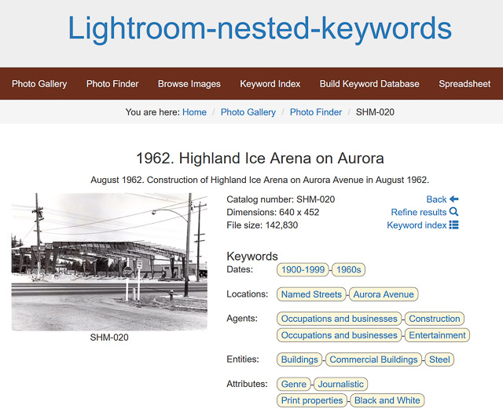
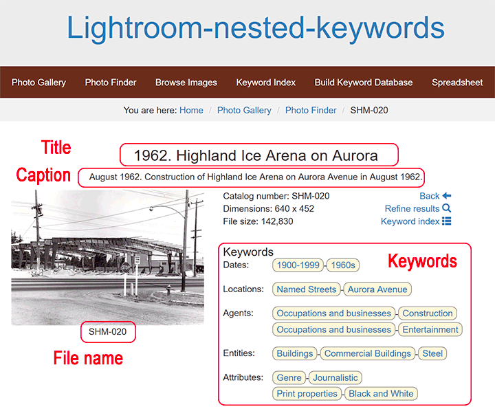
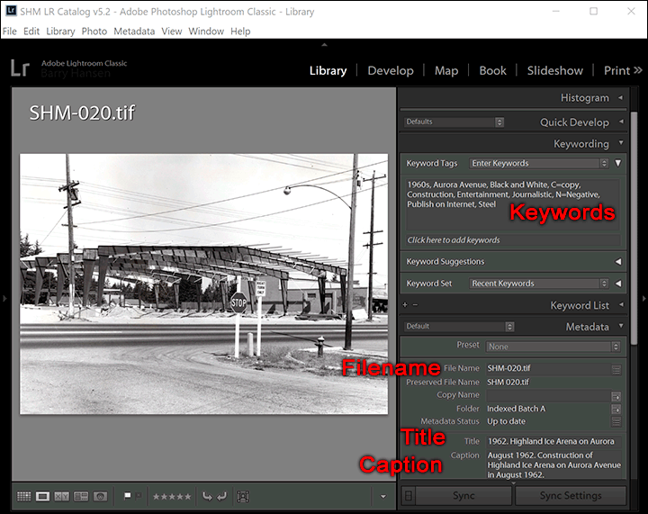
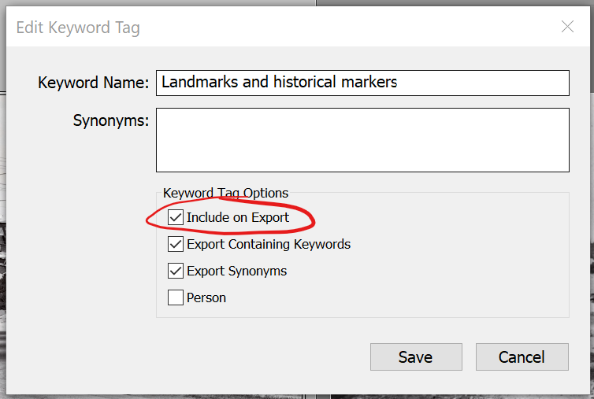
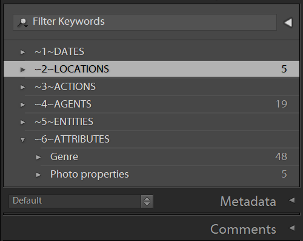

# Lightroom-nested-keywords

A responsive website to display and navigate Adobe Lightroom images that contain hierarchical keywords.



This project is written in HTML5, CSS3, PHP and is based on the Bootstrap framework.

## Background

Adobe Lightroom is a wonderful organizing tool for very large groups of photos. It can easily handle many thousands of images and offers several great ways to quickly find them. An especially good method is to tag images with keywords. You can organize keywords into a tree structure (hierarchies) to represent, for example, *countries > states > cities > neighborhoods*.

However, a limitation of Lightroom is its organizational schemes only work on single workstation. Although Lightroom can publish to the web, and it can embed keywords in metadata, the end result does not have any features to navigate by keyword on the web. This project intends to fill that need.

A well-chosen tree structure (taxonomy, or controlled vocabulary) along with consistently applying these keywords will be tremendously helpful to visitors on the world wide web.

**Lightroom-nested-keywords** provides PHP functions to process embedded metadata, and an example website to display and navigate images by keyword.

## Built With

* Bootstrap - Framework for responsive websites
* PHP – Server-side scripting
* jQuery – Client-side visual effects
* JavaScript – Auto-complete fields
* XML – Server-side data storage. (We do not use MySQL or other databases.)

## License

`barry-ha\Lightroom-nested-keywords` is subject to Gnu GPL v3 license.
Please read the LICENSE file for further details.

NOTE: The test images contained within are not my work.
DO NOT REDISTRIBUTE OR USE THESE IMAGES OUTSIDE THE DEMO.
If you are the owner of the images contained within, let me know so I can properly credit you or remove the images at your request.

## General Web Design Goals

The web user interface should be:

* Easy to navigate (our target audience is casual visitors)
* Responsive web design (layout supports both workstations and mobile devices)
* Only digital photos (not for museum artifacts, objects, or multimedia)
* All online photos are low resolution (to help protect property rights)
* File names are user friendly for download (not random 16-character GUIDs)
* Show useful metadata about each photo (description, keywords, filename, collection, etc.)
* Able to bookmark and share searches and search-results
* Include copyright and contact information on all web pages

Our goal is to implement the project in ways that can be maintained by subsequent web developers.

* The implementation uses public, well-known and well documented web technology.
* Software is built on the current stable version of each dependency (HTML5, CSS3, PHP 7, etc.)
* Where possible, the amount of custom programming is kept to a minimum.
* Programming adheres to modern best practices including documentation, comments and source code formatting as much as possible.

## Screen Shots

A brief introduction to our terminology and page layout is useful.

* **Catalog number** - is the **filename** minus its extension
* **Title** - comes from Lightroom's "title"
* **Caption** - comes from Lightroom's "caption"
* **Keywords** - comes from Lightroom's "keyword list"





----

## For the Archivist

These tips will help the person managing photos in Lightroom.

### 1. Avoid Blanks in Filenames

We recommend using hyphens to replace spaces in naming files. Avoid blanks and underscores.

Although some people substitute underscores “_” for spaces, this is not recommended on the web. The underscore will visually disappear if the word or link is underlined, especially in HTML links.

Although this PHP programming supports blanks in filenames, the spaces are not very user-friendly. Functionally, filenames containing blanks will work fine. For example, you can name an image “SHM  0123.jpg” and it will be displayed as expected with all other images. However, it will confuse the user. Spaces are a special character in web addresses and they are encoded as ‘%20’ in the address bar. For example, “SHM  0123.jpg” becomes “SHM%200123.jpg” in the URL.

### 2. Duplicate File Names Not Allowed

Every filename in must be unique, regardless of the extension. For example, you cannot use both “boat.tif” and “boat.jpg”.

The conflict is a side effect of publishing images from Lightroom, and not so much from this project's programming.

Although Lightroom and other file systems allow it, the publish-to-web process resolves everything into “.jpg” files. Therefore, publishing a source image file with one extension will overwrite any image file with the same base name but a different extension, because they both end up ".jpg".

There are no restrictions on how you organize your Lightroom source files into folders. The ‘export’ process will flatten the folder structure when it publishes your images.

NOTE: Avoid same-named files in different source folders in Lightroom. The file-export puts all images into the same destination folder, and duplicate file names will cause conflicts.

### 3. Choosing Titles and Captions

For best results, choose a short title and a long caption. The title is displayed under each image thumbnail, so, if the title were very long, then it ruins the even flow of thumbnails on the page.

* Bad title: “1913 (Cir.) Ronald School and Bell Tower. Teacher is Agnes Coffield. Oversize drawer.”
* Good title: “Circa 1913. Ronald School and bell tower”
Our reasoning is that details (teacher's name) is better suited for the caption, and that internal notes (oversize drawer) is irrelevent to web visitors.

Titles are shown with every thumbnail. A shorter title allows more thumbnails on a web page.

Captions are only shown on the detail page. The detail page has lots of screen space available and so the caption is a good place to provide lists of names, relatives, birthdays, background stories and other specifics.

Be sure to indicate dates consistently. We believe that dates are so important that we show the date, if known, in the first part of the title. Whatever you do, be consistent.

Indicate “circa” dates consistently. We prefer showing "circa" spelled out with the year. Better yet, use a more common word such as "about" instead of "circa" because it's more understandable in other countries.

* Example: “Circa 1913. Ronald School”

### 4. Choosing Keywords

For best results and usability, you should adopt a controlled vocabulary and apply it consistently.

Keyword hierarchy should be no more than 5 levels deep to remain understandable and usable. If you have more levels, it becomes difficult to follow. The web server code supports unlimited nesting but has only been tested to six levels deep.

Keywords are case-sensitive, especially during searches. Always choose keywords with the first letter in upper case, because the search function requires it.

Keywords should be in plural form, i.e. “Dresses” not “Dress”. This generally allows people to search for either singular or plural form and successfully find the terms.

Keywords can contain spaces, but be sure to use only a single space between words, e.g `Schoolᴗphotos` and not `Schoolᴗᴗphotos`. Otherwise the search results may not work as expected. As an aid during testing, to help identify the number of spaces as you traverse the photo collection, watch the URL for multiple plus marks: `results.html?key1=School++photos`

### 5. Applying Keywords to Images

You will need:

* Adobe Lightroom Classic CC v8 or above
* Alternatively, Photo Mechanic v5 or above

Keywording images is a time-consuming process. Our controlled vocabulary has 500 keywords, and we found that one archivist could tag about 30-50 images in a four-hour work session.

Every image should be assigned at least one keyword. This web design is strongly oriented toward handling keywords; if an image doesn’t have a keyword then it’s practically unfindable, unreachable and undisplayable.

You can hide selected keywords from the website. To do so, in Lightroom, edit the keyword and remove the check mark from “Include on Export”. For example, one of the keywords we use internally and are irrelevant to the web is the original media type, such as “Attributes | Photo properties | Original media | N=Negative”. We don't export this keyword and so it is not in the metadata after export. If you have keywords that are of no value to your web visitors, then choose to *not* export the keyword.


### 6. Selecting and Tagging Pictures to Publish

As a practical matter, the archivist must be able to identify for themselves which photos will, or will not be published on the Internet. This is necessary when items must be republished, for example, if some images or keywords or metadata is changed.

We recommend adding a keyword for this purpose, which is not exported, such as "Attributes > Publish on Internet".

### 7. Changing the Displayed Order of Topics

Suppose you want the “Keyword Index” page to show its columns in a specific order.

Ordinarily, everything is shown in alphabetical order, starting with the Lightroom's keyword list. Choose the order of topics by picking top-level keywords in alphabetical order. You can preface the top keywords with numbers to force the order. We also add tilde (\~) for visual attention to the archivist:


However, the special characters and upper-case are not attractive and are difficult to use in web pages, so we have a translation feature to substitute keywords:

* `adobe-xmp-for-php.php, around line 67`
* `$substitute_from=array( '~1~AGENTS', '~2~ACTIONS', '~3~ENTITIES', …`
* `$substitute_to  =array(    'Agents',    'Actions',    'Entities', …`

----

## For the Release Manager:

These tips will help the person transferring photos from Lightroom into the web server.

### You will need

* Adobe Lightroom Classic CC (to organize and tag your image library)
* File Transfer Program, FTP (such as free [FileZilla Client](https://filezilla-project.org/) or [Beyond Compare](https://www.scootersoftware.com/).

### Updating the Website with New Images

Here is an outline of exporting images from Lightroom, moving them to the web server, and refreshing its cached data.

1. **Lightroom Classic CC:**

   1. Select the images to export
   1. Export selected images to local folder “photos/large” at medium resolution. We recommend 640-px size on the longest edge, to save disk space and discourage people from using higher-resolution images without permission. Be sure to select the option to include keyword tags.
   1. Export selected images to local folder “photos/small” at thumbnail resolution. We recommend 133-px on the longest edge.

1. **FTP:**

   1. Delete any existing files inside the target system's folder of photos on the web server
   1. Copy all photos onto the web server, i.e. “photos/large” and “photos/small”

1. **Web browser:**

   1. Open web page http://photos.mysite.com/admin/build-keyword-database.html  This will refresh all of its internal data when it displays this page.
   1. Look for errors reported in the web page and resolve them.

----

## For the Web Master:

These tips will help the person starting their own photo library using this project for the first time.

### You will need:

* Familiarity with HTML5, PHP, CSS3, Bootstrap 3, jQuery 3
* Your favorite web coding workbench (such as free [Visual Studio Code](https://code.visualstudio.com/)
* No database (we do not need or use MySQL or any other database; instead, we save data in XML files using built-in PHP features)

Image files are stored locally on the web server. You can change this location in `php/custom.php` and store the source images almost anywhere, as long as the PHP file functions can read them.

Be sure to store images on a high-speed file system. If you use a remote the remote storage can reduce performance, since this program will frequently read file information.

### `php/custom.php`

The file “php/custom.php” must be updated for each website.

* Your own domain name:

```php
   $mySubdomain = 'www.';
   $myDomain = 'nestedkeywords';
   $myTLD = '.com';
```

* Contact information:

```php
   $myOwnerName = 'Barry Hansen';    // site owner's name
   $myWebmasterEmail = 'barry@electromagneticsoftware.com'; // notify when things break
```

* Your folder names where images are stored:

```php
   // image folder names
   // Note: Use names relative to site root.
   //       Individual PHP files must add relative paths as needed.
   //       If you move PHP source to a new folder, you manually adjust the new relative path.
   $myLargeImageFolder = 'photos/large';   // folder with all the images that contain hierarchical keywords
   $mySmallImageFolder = 'photos/small';   // folder with matching thumbnail images
```

* Your data file names:

```php
   // data file names
   $imageDatabaseBasename = 'xml/image-db';             // filename containing our Image database (file extension added later)
   $keywordTreeBasename   = 'xml/keyword-tree-db';      // filename of hierarchical keyword database (extension added later)
   $keywordFlatBasename   = 'xml/keyword-flat-db';      // filename of flat keyword->files database (extension added later)
   $autocompleteFilename  = 'js/autocomplete-keyword.js'; // filename of keyword list in javascript for autocomplete
```

* Your navigation bar:

````php
function showNavBar() {
?>
    <nav id="navigation" class="navbar navbar-default">
        <div class="container-fluid">
            <ul class="nav navbar-nav" id="main-nav">
                <li><a href="/index.html">Photo Gallery</a></li>
                <li><a href="/search.html">Photo Finder</a></li>
                <li><a href="/browse.html">Browse Images</a></li>
                <li><a href="/keywords.html">Keyword Index</a></li>
                <li><a href="/admin/build-keyword-database.html">Build Keyword Database</a></li>
                <li><a href="/admin/spreadsheet.html">Spreadsheet</a></li>
            </ul>
        </div>
    </nav>
<?php
}
````

* Your page footer:

```php
function showFooter() {
?>
    <address>
        <b>www.NestedKeywords.com</b>
        <br/>GitHub project barry-ha/Lightroom-Nested-Keywords
    </address>
<?php
}
```

### Linux File Permissions

If your web server is Linux-based, then make sure that a few selected files are **writeable** by the Apache process.  These files are overwritten by PHP programming in order to save the cached version of internal data structures.

* js/autocomplete-keyword.js
* xml/image-db.xml and .php
* xml/image-db.xml and .php
* xml/keyword-flat-db.xml and .php
* xml/keyword-tree-db.xml and .php
* image-list.csv

If these are not writable, an error message is shown by `admin/build-keyword-database.html`.

On some Linux systems, the Apache process runs in the ‘www-data’ user profile.

It might be simplest to use “chmod 777 filename” to individually allow each file to be rewritten, but choose your site's security carefully according to your own site's guidelines.

You can verify proper operation by visiting `admin/build-keyword-database.html` and look for links to the updated files in a table at the top. Open the links and verify the contents are as expected for your own particular updates.

### File Storage

Our implementation is to store images on a local drive to the web server. This gives good performance and it is a low-cost system in common usage.

For a sense of scale, our experience is that 1,800 image files uses 300 MB of disk space total including both large and thumbnail-sized photos.

Files are uploaded from your workstation to the web server via FTP, or by using your favorite method of transferring files.

Alternative: If additional space or CDN (content delivery system) is needed, a knowledgeable webmaster can modify the source PHP code to use cloud storage services. Note that several online file storage services are available at low-to-zero cost, such as Amazon Web Services (AWS), Google Drive, Microsoft OneDrive, Apple iCloud, and many more.

### Bookmarkable Links

The design is for every page to have a unique URL that can be bookmarked, shared and indexable by search engines. So, the Search strings are encoded in the URL and preserved across pages.

For example, suppose user “Alice” finds an interesting group of photos after her search, and wants to share the whole group of results with user “Bob.” She can copy/paste the URL from her address bar and send it to Bob. Then, Bob can open the URL and will see her entire search criteria along with the resulting thumbnails.

Furthermore, if Alice opens a single photo after her search, she can copy/paste the URL to Bob again. This time, because the photo was arrived at by her search, the URL will include the search criteria in the link. Bob can click 'Refine Results' and return to Alice’s original search page and modify it further.

URL Arguments Encoding:

* Within this project, a specific image is selected by its name on disk, including file extension, and not by catalog number or image ID. The file name can contain blanks and other special characters. The URL argument will be:
`?file= urlencoded basename.ext`
* Text = free form text to search. The URL argument is:
`?text=urlencoded string`
* Keywords = choice from keyword index. The URL arguments are:
`?key1=urlencoded string`
`&key2=urlencoded string`
`&key3=urlencoded string`

### Bootstrap Framework

This design uses the [Bootstrap v3 framework](https://getbootstrap.com/), an open source toolkit for web user interface technology. It provides a big boost for writing new websites from scratch and provides a responsive, modern look and feel.

At the time of writing, our organization's main website uses WordPress. Since Bootstrap has nothing in common WordPress, we run our digital photo collection project in a subdomain. This helps isolate any dependencies or conflicts between the two websites.

`barry-ha/Lightroom-nested-keywords` does not currently have a WordPress plug-in.

### Web Server

The current implementation uses a subdomain, e.g. `photos.nestedkeywords.com` instead of `www.nestedkeywords.com` so that the photo collection runs completely independently of an organization’s main website. There are no dependent files or frameworks between the two. Indeed, the photo subdomain can run on different hardware or different web hosting plan than the main “www” website.

This decision was made to make the photo gallery fully independent of the organization's main public website. It simplifies software development and avoids any built-in dependencies.

It is the webmaster’s responsibility to write their own HTML to integrate their organization's main website’s look-and-feel, color schemes or visual elements as much or as little degree as desired.

### Search Internals

Our text search will examine title, caption and filename for:

* Find a few letters or one word
* Find a few words in any order implicitly joined by AND

This is really quite basic and literal. Visitors can achieve more advanced search queries with Google’s index of the site. For example:
```www.google.com/search?q=Ronald site:nestedkeywords.com```

The “text search” is kept simple due to limited programming resource. For example, we don’t support similar-sounding words like [Soundex](https://en.wikipedia.org/wiki/Soundex), [stop words](https://en.wikipedia.org/wiki/Stop_words), [rank sorting](https://en.wikipedia.org/wiki/Ranking_(information_retrieval), [regular expressions](https://en.wikipedia.org/wiki/Regular_expression), or other complexity. Those solutions are left to the reader to exercise.

For example, if you don’t find “Jensen” then you’ll have to guess-n-check on your own for alternate spellings like “Jenson” and “Johnson”.

Some elements of this 'search' implementation:

* Ignores leading/trailing blanks
* Multiple words are treated as a list of independent words, searched in any order
* Multiple words imply AND
* Allows search for special characters (comma, ampersand, semicolon, etc)

Implementation is actually three different searches:

* Single word
* Multiple words
* Words enclosed in double-quotes

### Collections

A brief discussion of a museum's “collections of photos” is worthwhile, because this software does not have explicit support for “Collections.” This is by design.

Our museum defines “collection” as a body of photos or artifacts that were donated together in a group. We have several groups of images that were donated at different times from different sources. For physical images, the museum stores the original photos in groups for various topics such as:

1. SHM Historical Collection
2. Norman R. Hansen Collection
3. Playland Collection
4. Aurora Avenue Collection
5. School Class Photos Collection

However, once an image is scanned, indexed and keyworded, our museum has no particular need for distinguishing between the original groups of donations, or at what time each group was donated. Our web visitors generally don’t care or need to know how the photo arrived or where the museum is storing the original.

If, for some reason, a visitor needs to contact the museum to inquire about a specific photo, the catalog number (file name) is all we need to identify the collection. Then we can easily find the original print or negative within that collection.

As of Sept 2019, we have only published one "collection" online. If someday the “Collections” concept becomes important, our planned solution is to apply a keyword to each image to identify the collection. The new keywords (a collection name) should be nested under an umbrella keyword such as “Collections.” The robust keyword features of this web implementation will automatically make them easily findable and searchable, using the same approach as used with other existing keywords.

### Keyword Internals

When Lightroom saves hierarchical keywording to an image, it writes a list of all the words in the hierarchy to the **IPTC** keywords field. It also writes the hierarchy to "Hierarchical Subject" in XMP-lr. So, keywords "animal>mammal>fox" in our LR keyword list would, in a JPG file, be:

* IPTC keywords: "animal, fox, mammal", and in
* XMP-lr Hierarchical Subject: "animal|mammal|fox." ([source](https://www.lightroomqueen.com/community/threads/hierarchical-keywording.22661/))

[ExifTool](https://www.sno.phy.queensu.ca/~phil/exiftool/) can display all possible information from metadata. So, one possible implementation is to spawn the ExifTool to read the desired metadata, and then process its output into the desired formats.

[Adobe XML for WP WordPress](https://wordpress.org/plugins/adobe-xmp-for-wp/) plug-in can retrieve Lightroom metadata, including hierarchical keywords. This is a good source of PHP coding examples.

### Keyword Hierarchy Example

Here is an early keyword hierarchy of the Shoreline Historical Museum. For brevity, only the top few levels are shown.

Credit goes to Ken Winnick, Visual Cognetics, for the keyword taxonomy.

This example is documented here as an example of a reasonably good controlled vocabulary for a museum's digital collection. Please visit the public production website at photos.shorelinehistoricalmuseum.org/keywords.html to view the ‘live’ keyword tree.

The keywords are chosen for human readability. The PHP source code has no hard-coded keywords; the software will read all the keywords from image metadata and build its internal database from what it founds.

The prefix “\~1\~” determines the sort order of top-level groups. For our purposes, we want dates and locations to have prominence, so they come first.

* \~1\~DATES
1. 1800-1899
    * 1880s, 1890s
2. 1900-1999
    * 1900s, 1910s, 1920s, …
3. 2000-2099
    * 2000s, 2010s, 2020s, …
4. No Date
* \~2\~LOCATIONS
1. Cities
    * Ballard, Bellingham, Bothell, …
2. Landmarks and historical markers
3. Named Places
    * Aurora Village, Briarcrest, Brookside, …
4. Named Streets
    * 4th Ave NW, 5th Ave NW, 8th NW, …
5. Unknown location
* \~3\~ACTIONS
1. Non-moving
    * Conversing, Eating, Observing, Posing, …
2. Performing
    * Playing, Baseball, Basketball, Bicycling, …
3. Traveling
    * Driving, Parading, Riding, Running, Sailing, …
4. Undefined actions
5. Working
* \~4\~AGENTS
1. Livestock
    * Chickens, Cows, Goats, Horses, Mules
2. Occupations
    * Communications, Construction, Entertainment, …
3. People
    * Adults, Children, Elderly, Infants
4. Pets
    * Cats, Dogs
5. Wildlife
    * Birds, Fish, Mammals
* \~5\~ENTITIES
1. Buildings
    * Banks, Churches, Club / Civic Buildings, Commercial Buildings, …
2. Civic organizations
    * Boy Scouts, Coast Guard, Elk's Association, Shoreline Historical Society
3. Clothing
    * Casual wear, Costumes, Dress clothes, Eyewear, Footwear, Hats, …
4. Flags
5. Food
6. Furniture
7. Infrastructure
    * Boardwalks, Breakwaters, Bridges, Dams, Docks & Pilings, …
8. Natural features
    * Beaches, Canals, Cleared areas, Fields and Farms, Forests, …
9. Signage
10. Teams
    * Dance Teams, Lake Forest Park Baseball Team, …
11. Technologies
    * Cameras and photographs, Electric & electronic devices, …
* \~6\~ATTRIBUTES
1. Emotions
    * Bemused, Determined, Happy, Neutral, Proud, Sad, Serious, Worried
2. Events depicted
    * Civic Events, Fires, Holidays, Natural events, Social events, World's Fair
3. Photo properties
    * Genre, Non-SHMs, Photos of, Print properties, …
4. Viewer impressions
    * Activism, Anticipation, Barren, Beautiful, Careworn, Casual, …
